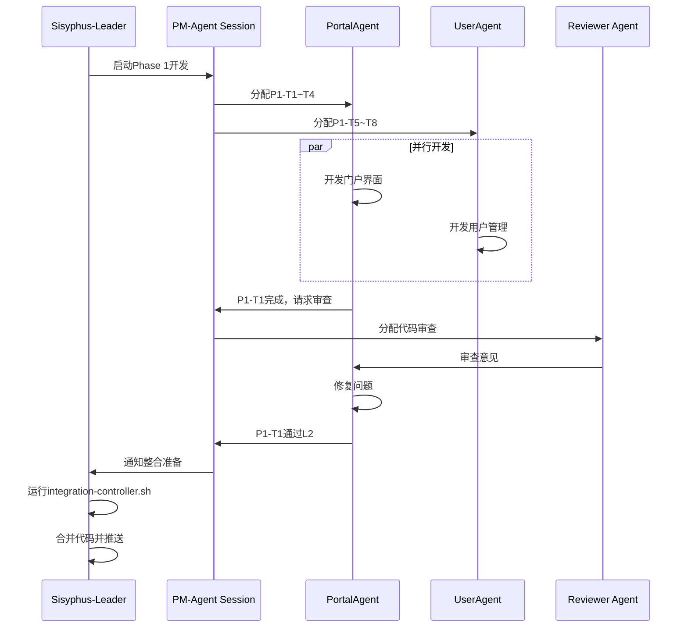

# RDP 项目 OpenCode Agent 团队实施方案

## 架构设计

基于 OpenCode 的 Multi-Session + MCP 架构：

```
┌─────────────────────────────────────────────┐
│         OpenCode Client (你的主界面)         │
│         Session: Sisyphus-Leader             │
│         Model: Claude Opus (最强推理)        │
└─────────────────────┬───────────────────────┘
                      │
    ┌─────────────────┼─────────────────┐
    ▼                 ▼                 ▼
┌──────────┐   ┌──────────┐   ┌──────────┐
│ Session  │   │ Session  │   │ Session  │
│Architect │   │ PM-Agent │   │ Reviewer │
│Opus      │   │Sonnet    │   │Sonnet    │
│(架构师)   │   │(协调)    │   │(审查)    │
└────┬─────┘   └────┬─────┘   └────┬─────┘
     │              │              │
     └──────────────┼──────────────┘
                    │
        ┌───────────┴───────────┐
        ▼                       ▼
┌─────────────────┐    ┌─────────────────┐
│  Feature Agents │    │   Shared State  │
│   (并行Session) │    │  (SQLite + Git) │
│                 │    │                 │
│ • PortalAgent   │    │ • Task Queue    │
│ • UserAgent     │    │ • Code Changes  │
│ • ProjectAgent  │    │ • Agent Status  │
│ • ... (12 more) │    │ • Messages      │
└─────────────────┘    └─────────────────┘
```

## 1. MCP Server 配置

创建 `.opencode/mcp.json`：

```json
{
  "mcpServers": {
    "rdp-task-coordinator": {
      "command": "python3",
      "args": ["${workspaceFolder}/agents/mcp/task_coordinator.py"],
      "env": {
        "RDP_PROJECT_ROOT": "${workspaceFolder}",
        "DB_PATH": "${workspaceFolder}/agents/data/tasks.db"
      },
      "description": "RDP任务协调器 - 管理所有Agent任务状态"
    },
    "rdp-code-validator": {
      "command": "python3", 
      "args": ["${workspaceFolder}/agents/mcp/code_validator.py"],
      "env": {
        "GOLANGCI_LINT_PATH": "services/api",
        "ESLINT_PATH": "apps/web"
      },
      "description": "代码验证服务 - 自动检查代码规范"
    },
    "rdp-integration-manager": {
      "command": "python3",
      "args": ["${workspaceFolder}/agents/mcp/integration_manager.py"],
      "env": {
        "INTEGRATION_STRATEGY": "feature-branch"
      },
      "description": "整合管理服务 - 自动合并Agent代码"
    }
  }
}
```

## 2. Session 分配策略

### Leader Session (你当前的Session)
- **模型**: Claude Opus
- **角色**: Sisyphus - 总协调者
- **职责**: 
  - 启动其他Agent sessions
  - 监督整体进度
  - 处理复杂架构决策
  - 整合最终交付

### 协调层 Sessions

```bash
# 启动 Architect Session (终端2)
opencode --session rdp-architect --model claude-opus
# 加载技能: architect, system-design

# 启动 PM-Agent Session (终端3)  
opencode --session rdp-pm --model claude-sonnet
# 加载技能: project-management, git-master

# 启动 Reviewer Session (终端4)
opencode --session rdp-reviewer --model claude-sonnet
# 加载技能: code-review, testing
```

### 功能层 Sessions (Phase 1示例)

```bash
# Phase 1 并行启动5个Agent (终端5-9)

# PortalAgent - 前端界面
opencode --session rdp-portal --model claude-sonnet
# 指令: 你是PortalAgent，负责门户首页、工作台、通知中心

# UserAgent - 用户管理  
opencode --session rdp-user --model claude-sonnet
# 指令: 你是UserAgent，负责认证、RBAC、组织架构

# ProjectAgent - 项目管理
opencode --session rdp-project --model claude-sonnet
# 指令: 你是ProjectAgent，负责项目CRUD、流程模板

# SecurityAgent - 安全合规
opencode --session rdp-security --model claude-sonnet
# 指令: 指令: 你是SecurityAgent，负责数据分级、审计日志

# InfraAgent - 基础设施 (已完成的)
opencode --session rdp-infra --model claude-sonnet
# 指令: 你是InfraAgent，负责数据库、部署、CI/CD
```

## 3. 任务协调机制

### 3.1 任务队列 (SQLite)

创建 `agents/data/schema.sql`：

```sql
-- Agent任务表
CREATE TABLE agent_tasks (
    id INTEGER PRIMARY KEY AUTOINCREMENT,
    task_id TEXT UNIQUE NOT NULL,  -- e.g., "P1-T1"
    agent_name TEXT NOT NULL,       -- e.g., "PortalAgent"
    phase INTEGER NOT NULL,         -- 1, 2, 3, 4
    title TEXT NOT NULL,
    status TEXT CHECK (status IN ('pending', 'in_progress', 'review', 'completed')),
    priority TEXT CHECK (priority IN ('P0', 'P1', 'P2')),
    dependencies TEXT,              -- JSON array of task_ids
    input_specs TEXT,               -- JSON 输入规格
    output_specs TEXT,              -- JSON 输出规格
    assignee_session TEXT,          -- OpenCode session ID
    created_at TIMESTAMP DEFAULT CURRENT_TIMESTAMP,
    started_at TIMESTAMP,
    completed_at TIMESTAMP,
    git_branch TEXT,                -- 工作分支
    review_status TEXT,
    review_comments TEXT
);

-- Agent通信表
CREATE TABLE agent_messages (
    id INTEGER PRIMARY KEY AUTOINCREMENT,
    from_agent TEXT NOT NULL,
    to_agent TEXT,
    message_type TEXT CHECK (message_type IN ('task', 'question', 'review', 'blocker')),
    content TEXT NOT NULL,
    context_refs TEXT,              -- 相关文件/代码引用
    read_status BOOLEAN DEFAULT 0,
    created_at TIMESTAMP DEFAULT CURRENT_TIMESTAMP
);

-- 代码变更表 (用于LSP共享)
CREATE TABLE code_changes (
    id INTEGER PRIMARY KEY AUTOINCREMENT,
    agent_name TEXT NOT NULL,
    file_path TEXT NOT NULL,
    change_type TEXT CHECK (change_type IN ('added', 'modified', 'deleted')),
    diff_summary TEXT,
    lsp_diagnostics TEXT,           -- LSP错误/警告
    commit_hash TEXT,
    created_at TIMESTAMP DEFAULT CURRENT_TIMESTAMP
);
```

### 3.2 Agent通信协议

创建 `agents/protocols/message_types.md`：

```yaml
# Agent间标准消息格式

TaskAssignment:
  type: "task"
  from: "PM-Agent"
  to: "<AgentName>"
  content:
    task_id: "P1-T1"
    title: "部门门户首页"
    requirements: "..."
    deadline: "2026-02-25"
    acceptance_criteria:
      - "响应式布局"
      - "公告列表支持分页"
  context:
    related_files:
      - "apps/web/src/pages/portal/"
      - "docs/01_需求文档.md"
    dependencies: []

CodeReview:
  type: "review"
  from: "Reviewer Agent"
  to: "<AgentName>"
  content:
    task_id: "P1-T1"
    status: "needs_fix"
    comments:
      - file: "PortalPage.tsx"
        line: 42
        issue: "缺少错误处理"
        suggestion: "添加try-catch"
  context:
    pr_url: "..."
    test_results: "..."

Blocker:
  type: "blocker"
  from: "<AgentName>"
  to: "PM-Agent"
  content:
    task_id: "P1-T1"
    description: "依赖的User API未就绪"
    impact: "无法测试登录功能"
    requested_help: "UserAgent提前交付P1-T5"
```

## 4. 具体实施步骤

### Step 1: 初始化环境

```bash
# 1. 创建OpenCode配置目录
mkdir -p .opencode

# 2. 创建MCP servers目录
mkdir -p agents/mcp
mkdir -p agents/data

# 3. 初始化数据库
sqlite3 agents/data/tasks.db < agents/data/schema.sql

# 4. 创建Session启动脚本
cat > scripts/start-agent-team.sh << 'EOF'
#!/bin/bash

# 启动RDP Agent团队的全部Sessions

echo "🚀 启动RDP Agent团队..."

# 协调层
opencode --session rdp-architect --model claude-opus &
opencode --session rdp-pm --model claude-sonnet &
opencode --session rdp-reviewer --model claude-sonnet &

# Phase 1 Feature Agents (等待启动信号)
# opencode --session rdp-portal --model claude-sonnet &
# opencode --session rdp-user --model claude-sonnet &
# ...

echo "✅ Agent团队已启动"
echo "使用 'opencode --list' 查看所有sessions"
EOF

chmod +x scripts/start-agent-team.sh
```

### Step 2: 启动Leader Session

在**当前Session**（Sisyphus-Leader）中：

```bash
# 加载项目上下文
read agents/README.md
read agents/tasks/agent_overview.md

# 启动任务协调器
# (MCP server会自动启动)

# 检查任务状态
@rdp-task-coordinator check_status
```

### Step 3: 分配Phase 1任务

```bash
# 启动PortalAgent Session
opencode --session rdp-portal --model claude-sonnet

# 在该Session中初始化：
"""
你是PortalAgent，负责RDP项目的门户界面模块。

当前任务: P1-T1 ~ P1-T4
- P1-T1: 部门门户首页
- P1-T2: 个人工作台  
- P1-T3: 消息通知中心
- P1-T4: 全局搜索UI

技术栈: React 18 + TypeScript + Vite + Ant Design 5
代码规范: 
- 路径别名使用 @types, @components
- 代码注释使用英文
- UI文案使用中文

依赖: 
- UserAgent (P1-T5) 提供用户API
- 当前可先使用mock数据

请阅读:
1. agents/outputs/infra-scaffold/DELIVERY.md
2. agents/tasks/phase1_tasks.md
3. QUICKSTART.md

完成后通知PM-Agent进行审查。
"""
```

### Step 4: 并行开发流程



## 5. 代码共享与同步

### 5.1 Git工作流

```bash
# 每个Agent在自己的feature分支开发

# PortalAgent
git checkout -b feature/portal-phase1
# ...开发...
git add .
git commit -m "feat: portal homepage implementation

- Add responsive layout
- Implement announcement list
- Add carousel for honors

Task: P1-T1
Agent: PortalAgent"
git push origin feature/portal-phase1

# InfraAgent(Leader)整合
git fetch origin
git checkout main
git merge feature/portal-phase1 --no-ff -m "integrate: PortalAgent Phase 1 work

Co-authored-by: PortalAgent"
```

### 5.2 LSP共享状态

```python
# agents/mcp/lsp_sync.py

class LSPSyncService:
    """同步所有Agent的LSP状态"""
    
    def share_diagnostics(self, agent_name, file_path, diagnostics):
        """共享语法错误/警告"""
        db.insert("code_changes", {
            "agent_name": agent_name,
            "file_path": file_path,
            "lsp_diagnostics": json.dumps(diagnostics),
            "timestamp": now()
        })
    
    def check_conflicts(self, agent_name, file_path):
        """检查是否有其他Agent修改了同一文件"""
        conflicts = db.query("""
            SELECT * FROM code_changes 
            WHERE file_path = ? 
            AND agent_name != ?
            AND created_at > ?
        """, [file_path, agent_name, last_sync_time])
        
        return conflicts
```

## 6. 监控仪表板

创建 `agents/mcp/dashboard.py`：

```python
# 简单的Web仪表板显示所有Agent状态

from flask import Flask, jsonify

app = Flask(__name__)

@app.route('/api/agents/status')
def get_agents_status():
    return jsonify({
        "phase": "Phase 1",
        "agents": [
            {
                "name": "PortalAgent",
                "session": "rdp-portal",
                "status": "in_progress",
                "tasks_completed": 2,
                "tasks_total": 4,
                "last_activity": "2026-02-22T10:30:00"
            },
            # ...
        ],
        "overall_progress": "45%"
    })

@app.route('/api/tasks/queue')
def get_task_queue():
    # 返回待分配任务
    pass
```

## 7. 实施建议

### 推荐配置

| Session | 模型 | 数量 | 职责 |
|---------|------|------|------|
| Leader | Opus | 1 | 总协调、复杂决策 |
| Architect | Opus | 1 | 架构设计、接口定义 |
| PM | Sonnet | 1 | 任务分配、进度跟踪 |
| Reviewer | Sonnet | 1 | 代码审查、质量把控 |
| Feature Agent | Sonnet/Haiku | 5-10 | 具体功能实现 |

### 启动顺序

1. **立即启动**: Leader (当前Session)
2. **Phase 0**: Architect + PM + Reviewer
3. **Phase 1**: 5个Feature Agents并行
4. **Phase 2**: 根据依赖关系分批启动
5. **Phase 3-4**: 继续并行

### 成本控制

- **Opus**: 仅用于Leader和Architect (2个sessions)
- **Sonnet**: PM、Reviewer、Feature Agents (10+ sessions)
- **Haiku**: 可选用于简单任务
- **本地模型**: 代码验证等可本地化处理

## 8. 快速开始命令

```bash
# 1. 在当前Session查看任务总览
read agents/tasks/agent_overview.md

# 2. 启动Architect Session (新终端)
opencode --session rdp-architect --model claude-opus

# 3. 在Architect Session中:
"设计Phase 1的详细接口定义"

# 4. 启动PM Session (新终端)
opencode --session rdp-pm --model claude-sonnet

# 5. 在PM Session中:
"根据agent_overview.md分解Phase 1任务"

# 6. 启动Feature Agents (多个终端)
for agent in portal user project security; do
    opencode --session rdp-$agent --model claude-sonnet &
done

# 7. 使用Mgrep并行搜索 (在当前Session)
mgrep "user.*model" --agents rdp-user,rdp-security

# 8. 监控进度
curl http://localhost:5000/api/agents/status
```

---

这套方案利用了OpenCode的所有核心能力：
- ✅ Multi-Session并行
- ✅ MCP Server扩展
- ✅ Session间通信
- ✅ Mgrep高效搜索
- ✅ LSP代码共享

你可以立即开始实施！需要我帮你创建MCP server的Python代码吗？
