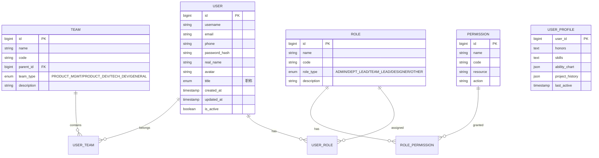

# 研发平台实施方案

## 目录

1. [项目概述](#1-项目概述)
2. [系统架构设计](#2-系统架构设计)
3. [技术选型与开源组件](#3-技术选型与开源组件)
4. [模块设计方案](#4-模块设计方案)
5. [数据架构](#5-数据架构)
6. [集成方案](#6-集成方案)
7. [实施计划](#7-实施计划)
8. [风险与应对](#8-风险与应对)
9. [资源估算](#9-资源估算)

---

## 1. 项目概述

### 1.1 项目背景

本研发平台面向微波系统研发部门，涵盖产品管理、产品开发、技术开发三个实体团队及综合管理虚拟团队。平台需要支持：

- **单机/模块/软件/技术开发**全生命周期管理
- **IPD集成产品开发流程**数字化落地
- **产品货架与技术货架**重用策略
- **知识资产沉淀与复用**
- **团队协作与即时通信**

### 1.2 建设目标

| 目标维度 | 具体目标 |
|---------|---------|
| 流程规范化 | 实现IPD流程数字化，确保开发过程可追溯、可管控 |
| 资产复用化 | 建立产品货架、技术货架、知识库三大资产中心 |
| 协作高效化 | 集成项目管理、即时通信、技术论坛，提升协作效率 |
| 决策数据化 | 通过仪表盘、报表提供多维度决策支持 |

### 1.3 核心用户角色

```
┌─────────────────────────────────────────────────────────────┐
│                        部门领导                              │
│                    (战略决策/资源调配)                        │
└───────────────────────┬─────────────────────────────────────┘
                        │
        ┌───────────────┼───────────────┐
        │               │               │
┌───────▼──────┐ ┌──────▼──────┐ ┌──────▼──────┐
│  产品管理团队  │ │ 产品开发团队  │ │ 技术开发团队  │
│ ·型号管理    │ │ ·A产品线    │ │ ·天线设计   │
│ ·可靠性管理  │ │ ·B产品线    │ │ ·射频设计   │
│ ·需求对接    │ │ ·C产品线    │ │ ·数字设计   │
└──────────────┘ └─────────────┘ └─────────────┘
                        │
               ┌────────▼────────┐
               │   综合管理虚拟团队  │
               │ (安全/保密/档案/   │
               │  宣传/6S/党建)     │
               └─────────────────┘
```

---

## 2. 系统架构设计

### 2.1 整体架构


### 2.2 微服务架构


### 2.3 模块依赖关系图


---

## 3. 技术选型与开源组件

### 3.1 技术栈总览

| 层次 | 技术选型 | 版本建议 | 选型理由 |
|------|---------|---------|---------|
| **前端框架** | Vue3 + TypeScript | 3.4+ | 响应式系统、组合式API、类型安全 |
| **UI组件库** | Element Plus + Ant Design Vue | 2.x | 丰富的企业级组件、良好的生态 |
| **状态管理** | Pinia | 2.x | Vue3官方推荐、TypeScript友好 |
| **后端框架** | Spring Boot | 3.2+ | 成熟稳定、生态丰富、微服务支持 |
| **微服务框架** | Spring Cloud Alibaba | 2022+ | 完善的微服务解决方案 |
| **数据库** | PostgreSQL | 16+ | 强大的JSON支持、扩展性好 |
| **缓存** | Redis | 7+ | 高性能、支持多种数据结构 |
| **搜索引擎** | Elasticsearch | 8+ | 全文搜索、聚合分析 |
| **消息队列** | RabbitMQ | 3.12+ | 可靠的消息传递、工作流支持 |
| **文件存储** | MinIO | latest | 兼容S3、高性能对象存储 |
| **容器化** | Docker + Kubernetes | - | 标准化部署、弹性伸缩 |

### 3.2 各模块开源组件选型

#### 3.2.1 门户界面

| 功能 | 开源组件 | 说明 |
|------|---------|------|
| 仪表盘模板 | **black-dashboard-react** | React管理仪表盘，美观现代 |
| 工作台布局 | **vue-grid-layout** | 可拖拽的网格布局系统 |
| 图表组件 | **ECharts** / **AntV G2** | 数据可视化 |
| 日历组件 | **FullCalendar** | 日程管理展示 |

**推荐方案**：基于Vue3 + Element Plus自研，参考black-dashboard-react的设计风格

#### 3.2.2 用户管理模块

| 功能 | 开源组件 | 说明 |
|------|---------|------|
| 组织架构 | **自研** | 树形结构展示部门、团队、岗位 |
| 权限控制 | **Spring Security + JWT** | 认证授权 |
| RBAC模型 | **自研** | 角色-权限-资源模型 |
| 个人页面 | 参考GitHub Profile | 展示项目、贡献、能力图 |

**推荐方案**：基于Spring Security自研，组织架构和权限模型根据需求定制

#### 3.2.3 项目管理模块

| 功能 | 开源组件 | 说明 |
|------|---------|------|
| 甘特图 | **dhtmlx-gantt** / **gantt-elastic** | 项目进度可视化 |
| 看板 | **Vue.Draggable** + 自研 | 拖拽式任务看板 |
| 项目模板 | **Plane** (参考) | 轻量级项目管理理念 |
| 自动排程 | **自研** | 基于CPM算法实现 |

**推荐方案**：
- 甘特图：使用dhtmlx-gantt（功能完整）
- 项目管理核心：参考Plane架构自研
- 自动排程：基于CPM算法自研排程引擎

#### 3.2.4 项目开发模块（工作流引擎）

| 功能 | 开源组件 | 说明 |
|------|---------|------|
| 流程设计器 | **bpmn-js** | BPMN 2.0可视化设计器 |
| 流程引擎 | **bpmn-engine** (paed01) | BPMN 2.0执行引擎 |
| 流程模型 | **camunda-bpmn-moddle** | BPMN模型解析 |
| Git集成 | **JGit** (Java) / **isomorphic-git** (JS) | Git操作库 |

**推荐方案**：
- 流程设计器：**bpmn-js**（业界标准）
- 流程引擎：**bpmn-engine**（Node.js，轻量）或自研Java版本
- Git集成：**JGit** + 本地Git仓库

#### 3.2.5 产品/技术货架模块

| 功能 | 开源组件 | 说明 |
|------|---------|------|
| 产品目录 | **自研** | 分类浏览、筛选 |
| 版本管理 | **Git LFS** | 大文件版本控制 |
| 文件预览 | **kkFileView** | 多格式文件在线预览 |

**推荐方案**：自研核心功能，集成kkFileView实现文件预览

#### 3.2.6 知识库模块

| 功能 | 开源组件 | 说明 |
|------|---------|------|
| Wiki引擎 | **Wiki.js** (参考) | 现代Wiki系统设计理念 |
| Markdown编辑器 | **Vditor** / **Milkdown** | 所见即所得编辑器 |
| 全文搜索 | **Elasticsearch** | 高性能搜索 |
| Obsidian集成 | **自研** + Obsidian API | 双向同步 |
| Zotero集成 | **Zotero API** | 文献管理集成 |

**推荐方案**：
- 核心Wiki：参考Wiki.js架构自研
- Markdown编辑器：**Vditor**（功能完善、中文友好）
- 与Obsidian集成：通过本地文件系统 + Git实现

#### 3.2.7 技术论坛模块

| 功能 | 开源组件 | 说明 |
|------|---------|------|
| 论坛系统 | **Flarum** (参考) | 现代论坛设计理念 |
| 富文本编辑 | **Quill.js** / **TipTap** | 内容编辑器 |
| 实时通知 | **WebSocket** | 消息推送 |

**推荐方案**：自研轻量级论坛，参考Flarum的交互设计

#### 3.2.8 即时通信模块

| 功能 | 开源组件 | 说明 |
|------|---------|------|
| IM核心 | **Mattermost** | 开源Slack替代品 |
| WebSocket | **Socket.IO** | 实时通信 |
| 消息存储 | **MongoDB** | 消息持久化 |

**推荐方案**：
- **推荐**：集成Mattermost作为IM后端，自研前端界面
- **备选**：基于Socket.IO自研轻量级IM

---

## 4. 模块设计方案

### 4.1 门户界面模块

#### 功能设计


#### 技术实现

- **前端**：Vue3 + Element Plus + vue-grid-layout
- **组件化设计**：每个功能区块作为独立组件，支持拖拽布局
- **数据聚合**：通过BFF层聚合各模块数据

### 4.2 用户管理模块

#### 数据模型



#### 功能清单

| 功能 | 说明 |
|------|------|
| 用户CRUD | 创建、编辑、禁用、删除用户 |
| 组织架构 | 树形展示部门-团队-岗位 |
| 角色管理 | 管理员、部门领导、团队组长、设计师、其他 |
| 职称体系 | 设计员、助理工程师、工程师、高级工程师、研究员 |
| 个人页面 | GitHub风格个人主页 |
| 能力图 | 雷达图展示技能分布 |
| 项目履历 | 历史项目参与记录 |

### 4.3 项目管理模块

#### 项目创建流程


#### 自动排程算法


#### 核心功能

| 功能 | 技术方案 |
|------|---------|
| 项目模板 | 预定义模板 + 自定义模板 |
| 自动排程 | CPM关键路径法 + 资源约束 |
| 甘特图 | dhtmlx-gantt组件 |
| 仪表盘 | ECharts数据可视化 |
| MS Project导入导出 | mpxj库解析.mpp文件 |

### 4.4 项目开发模块

#### 活动执行流程


#### 本地软件集成方案


**自定义协议设计**：
- `rdp://open?path=/project/file.md&app=obsidian`
- `rdp://open?path=/project/pcb.schdoc&app=altium`

### 4.5 产品货架模块

#### 功能架构


### 4.6 技术货架模块

#### 技术树展示


### 4.7 知识库模块

#### 知识分类体系


#### Obsidian集成方案


### 4.8 技术论坛模块

#### 功能设计

- 板块管理：按技术领域划分板块
- 帖子管理：发帖、回复、点赞、收藏
- 富文本编辑：支持Markdown、代码高亮
- 通知系统：@提及、回复通知
- 搜索功能：全文检索帖子内容

### 4.9 即时通信模块

#### 架构设计


---

## 5. 数据架构

### 5.1 数据库设计

#### 5.1.1 PostgreSQL核心库


#### 5.1.2 MongoDB消息库

```javascript
// 消息集合
{
  _id: ObjectId,
  conversation_id: String,  // 会话ID
  sender_id: Number,        // 发送者ID
  message_type: String,     // text/file/image/system
  content: String,          // 消息内容
  file_info: {              // 文件信息（可选）
    file_id: String,
    file_name: String,
    file_size: Number
  },
  mentions: [Number],       // @的用户ID列表
  created_at: Date,
  updated_at: Date,
  is_deleted: Boolean
}

// 会话集合
{
  _id: ObjectId,
  conversation_type: String, // private/group
  participants: [Number],    // 参与者ID列表
  last_message: Object,      // 最后一条消息
  unread_count: Map,         // 用户未读数
  created_at: Date
}
```

### 5.2 数据流图


### 5.3 数据同步策略

| 场景 | 同步方式 | 说明 |
|------|---------|------|
| 用户信息 | 实时同步 | 用户变更立即同步 |
| 项目数据 | 准实时 | 5秒延迟，批量写入 |
| 消息数据 | 实时 | WebSocket推送 |
| 搜索索引 | 异步 | 消息队列异步更新 |
| 文件数据 | 异步 | 后台同步到Git |

---

## 6. 集成方案

### 6.1 Git集成


### 6.2 Obsidian集成

**方案**：通过Git仓库双向同步

```
局域网服务器                    本地工作站
┌─────────────┐              ┌─────────────┐
│ 研发平台     │              │  Obsidian   │
│  知识库     │◄────────────►│  本地库     │
│  Git仓库    │   Git同步     │  Git仓库    │
└─────────────┘              └─────────────┘
```

### 6.3 Zotero集成


### 6.4 外部系统集成

| 系统 | 集成方式 | 功能 |
|------|---------|------|
| ERP | REST API | 同步BOM、物料信息 |
| MES | REST API | 同步生产任务、工艺文件 |
| LDAP/AD | LDAP协议 | 统一身份认证 |
| 邮件系统 | SMTP/IMAP | 邮件通知 |

---

## 7. 实施计划

### 7.1 阶段划分


### 7.2 第一阶段：基础平台（6周）

**目标**：搭建基础架构，实现用户管理和项目基础功能

| 周次 | 任务 | 交付物 |
|------|------|--------|
| 1-2 | 基础架构搭建 | 开发环境、CI/CD、基础服务 |
| 3-4 | 用户管理模块 | 用户CRUD、组织架构、权限体系 |
| 5 | 门户界面 | 工作台、仪表盘、快捷入口 |
| 6-8 | 项目管理模块(基础) | 项目创建、基础甘特图、项目列表 |

**技术重点**：
- 微服务基础框架搭建
- 统一认证授权体系
- 前端基础组件库

### 7.3 第二阶段：核心开发（8周）

**目标**：实现工作流引擎和项目开发核心功能

| 周次 | 任务 | 交付物 |
|------|------|--------|
| 9-11 | 工作流引擎 | BPMN设计器、流程引擎、流程模板 |
| 12-14 | 项目开发模块 | 活动执行、进度追踪、任务管理 |
| 15-16 | 文件服务 | 文件上传下载、版本管理 |
| 17 | Git集成 | 本地Git仓库、版本控制 |

**技术重点**：
- bpmn-js流程设计器集成
- 工作流引擎状态机实现
- Git操作封装

### 7.4 第三阶段：资产管理（7周）

**目标**：实现产品货架、技术货架、知识库

| 周次 | 任务 | 交付物 |
|------|------|--------|
| 18-19 | 产品货架模块 | 产品展示、分类浏览、选用功能 |
| 20-21 | 技术货架模块 | 技术树、技术详情、版本管理 |
| 22-24 | 知识库模块 | Wiki编辑、分类管理、Obsidian集成 |
| 25 | 搜索服务 | 全文搜索、智能推荐 |

**技术重点**：
- Elasticsearch搜索索引构建
- Vditor编辑器集成
- 与Obsidian的双向同步

### 7.5 第四阶段：协作功能（7周）

**目标**：实现技术论坛、即时通信，完成系统测试和上线

| 周次 | 任务 | 交付物 |
|------|------|--------|
| 26-27 | 技术论坛模块 | 板块管理、发帖回帖、富文本编辑 |
| 28-30 | 即时通信模块 | 私聊、群聊、文件传输 |
| 31-32 | 系统集成测试 | 测试报告、Bug修复 |
| 33-34 | 用户培训与上线 | 操作手册、培训、正式上线 |

**技术重点**：
- Mattermost集成或自研IM
- WebSocket实时通信
- 系统性能优化

### 7.6 里程碑

| 里程碑 | 时间 | 标志 |
|--------|------|------|
| M1 | 第6周末 | 基础平台可用，可创建和管理用户、项目 |
| M2 | 第14周末 | 核心开发功能可用，可执行项目开发流程 |
| M3 | 第21周末 | 资产管理功能可用，产品/技术/知识可沉淀 |
| M4 | 第28周末 | 协作功能可用，团队可在线协作 |
| M5 | 第34周末 | 系统正式上线运行 |

---

## 8. 风险与应对

### 8.1 技术风险

| 风险 | 影响 | 应对措施 |
|------|------|---------|
| 工作流引擎复杂度高 | 开发延期 | 采用成熟开源组件bpmn-js，降低自研风险 |
| Git集成实现困难 | 文件版本管理受阻 | 预留2周技术预研，准备备选方案 |
| 局域网部署限制 | 部分功能受限 | 提前调研离线可用方案，如Mattermost本地部署 |
| 性能瓶颈 | 用户体验差 | 提前规划缓存策略、数据库优化 |

### 8.2 管理风险

| 风险 | 影响 | 应对措施 |
|------|------|---------|
| 需求变更频繁 | 开发返工 | 建立需求变更流程，每个阶段冻结需求 |
| 多团队协作困难 | 进度不一致 | 每周同步会议，统一接口规范 |
| 用户接受度低 | 推广困难 | 早期引入用户参与，迭代优化 |

### 8.3 风险矩阵

```
影响程度
   高 │  ③需求变更    ④性能瓶颈
      │  ①工作流复杂
   中 │              ②Git集成
      │
   低 │
      └─────────────────────────
        低          中          高
                  发生概率

① 重点关注：技术预研 + 成熟组件
② 提前准备：技术预研2周 + 备选方案
③ 流程管控：变更控制委员会
④ 架构设计：性能测试 + 优化方案
```

---

## 9. 资源估算

### 9.1 人力资源

| 角色 | 人数 | 职责 |
|------|------|------|
| 项目经理 | 1 | 项目管理、进度把控、风险管控 |
| 架构师 | 1 | 技术架构设计、技术选型、代码审查 |
| 前端开发工程师 | 3 | 前端模块开发、UI实现 |
| 后端开发工程师 | 4 | 后端服务开发、数据库设计 |
| DevOps工程师 | 1 | CI/CD、部署运维、监控 |
| 测试工程师 | 2 | 功能测试、性能测试、自动化测试 |
| UI设计师 | 1 | 界面设计、交互设计 |
| **合计** | **13** | |

### 9.2 硬件资源

| 环境 | 配置 | 数量 | 用途 |
|------|------|------|------|
| 生产服务器 | 32核64G | 3 | 应用服务集群 |
| 数据库服务器 | 16核32G | 2 | PostgreSQL主从 |
| 文件服务器 | 16核32G/10T | 1 | MinIO文件存储 |
| 开发服务器 | 8核16G | 2 | 开发测试环境 |
| **合计** | | **8** | |

### 9.3 软件资源

| 软件 | 许可 | 用途 |
|------|------|------|
| 操作系统 | CentOS/Ubuntu (开源) | 服务器操作系统 |
| 数据库 | PostgreSQL (开源) | 关系型数据库 |
| 缓存 | Redis (开源) | 缓存与会话 |
| 搜索 | Elasticsearch (开源) | 全文搜索引擎 |
| 消息队列 | RabbitMQ (开源) | 异步消息处理 |
| 文件存储 | MinIO (开源) | 对象存储 |
| 监控 | Prometheus+Grafana (开源) | 系统监控 |
| **软件成本** | **0元** | 全部开源 |

### 9.4 时间估算

| 阶段 | 周期 | 工作量（人月） |
|------|------|---------------|
| 第一阶段 | 6周 | 18人月 |
| 第二阶段 | 8周 | 24人月 |
| 第三阶段 | 7周 | 21人月 |
| 第四阶段 | 7周 | 21人月 |
| **总计** | **28周（7个月）** | **84人月** |

### 9.5 成本估算

| 成本项 | 金额（万元） |
|--------|-------------|
| 人力成本（84人月×1.5万/人月） | 126 |
| 硬件采购 | 30 |
| 网络与基础设施 | 10 |
| 培训与差旅 | 5 |
| 不可预见费用（10%） | 17 |
| **总计** | **188** |

---

## 附录

### 附录A：技术选型对比表

| 功能 | 方案A | 方案B | 推荐 |
|------|-------|-------|------|
| 前端框架 | Vue3 | React | Vue3（团队熟悉） |
| 后端框架 | Spring Boot | Django | Spring Boot（生态丰富） |
| 流程引擎 | bpmn-engine | 自研 | bpmn-engine（成熟） |
| IM方案 | Mattermost集成 | 自研 | Mattermost（功能完整） |
| 编辑器 | Vditor | Milkdown | Vditor（中文友好） |

### 附录B：开源组件清单

| 组件名称 | 许可证 | 用途 |
|---------|--------|------|
| Vue3 | MIT | 前端框架 |
| Element Plus | MIT | UI组件库 |
| Spring Boot | Apache 2.0 | 后端框架 |
| PostgreSQL | PostgreSQL | 数据库 |
| Redis | BSD | 缓存 |
| Elasticsearch | SSPL | 搜索引擎 |
| bpmn-js | MIT | 流程设计器 |
| bpmn-engine | MIT | 流程引擎 |
| Vditor | MIT | Markdown编辑器 |
| Mattermost | MIT | 即时通信 |
| MinIO | AGPL | 对象存储 |

### 附录C：部署架构图


---

**文档版本**：v1.0  
**编制日期**：2026年2月  
**编制人**：解决方案架构师
